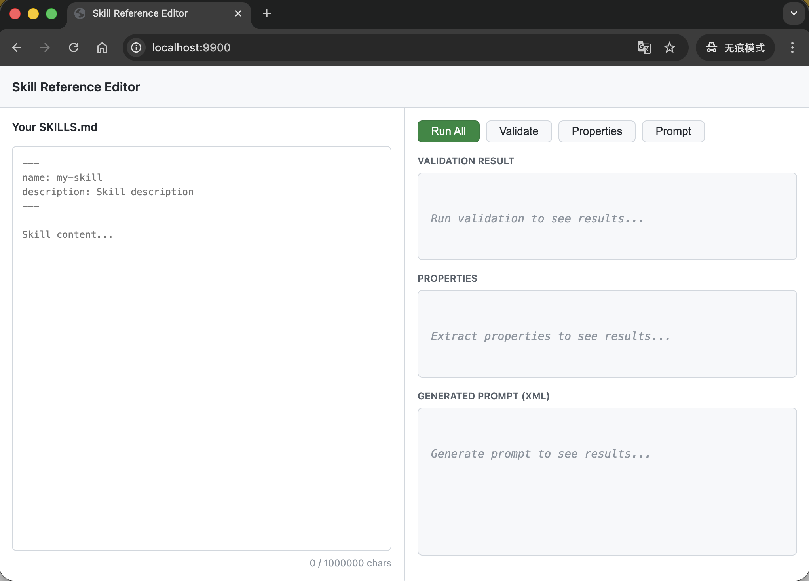
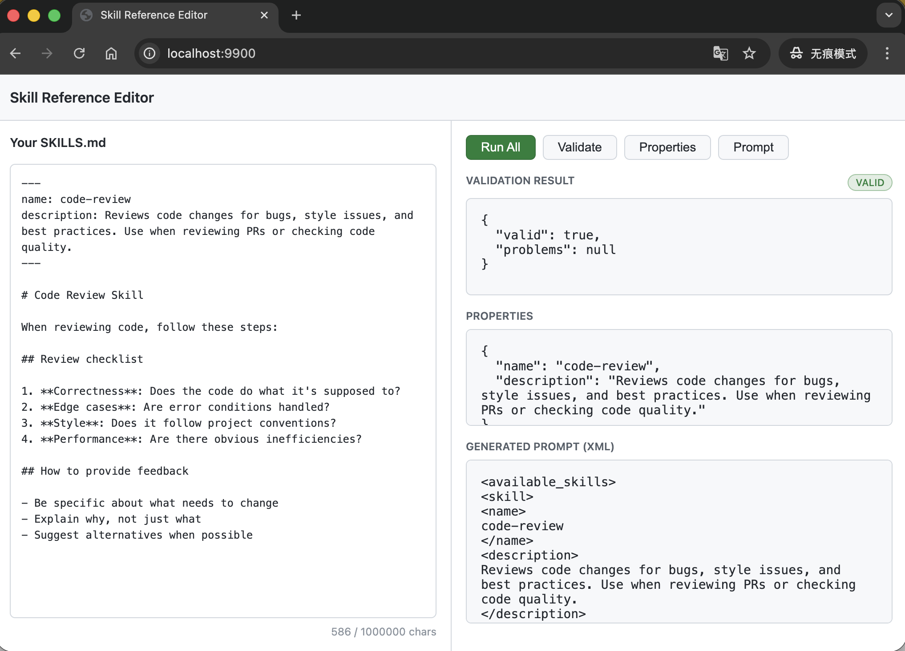
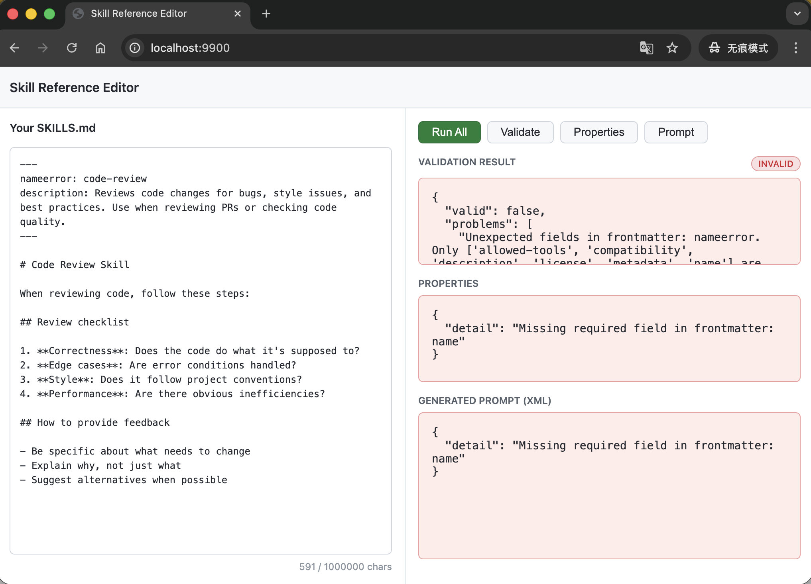

# Agent Skills文件验证工具

[](README.md) [](README_ZH.md)

## 项目介绍

**Agent Skills Ref** 基于开源[Agent Skills Ref](https://github.com/agentskills/agentskills/tree/main/skills-ref)封装的本地网页工具，用于验证、解析和生成 Agent Skills 定义文件。

将官方的 Skills Ref 命令进行了本地化，并提供 API 接口和网页展示。

## 主要功能

* 验证skill：`skills-ref validate`
* 提取skill参数: `skills-ref read-properties`
* 一键生成符合 AI Agent 格式要求的 XML:`skills-ref to-prompt`

## 使用说明

### 1. 安装依赖

启动应用前，请先安装项目依赖：

```bash
pip install -r requirements.txt
```

### 2. 启动服务

在项目根目录下运行以下命令启动 API 服务器：

```bash
uvicorn main:app --host 0.0.0.0 --port 9900 --reload
```

服务器将在 `http://0.0.0.0:9900` 上启动。

### 3. 访问编辑器

打开浏览器访问以下地址即可使用可视化编辑器：

```
http://localhost:9900
```

或者直接打开 `page.html` 文件（需要确保 API 服务已在后台运行并监听 9900 端口）。

### 4. 核心接口

* `POST /validate/text`: 验证 Skill Markdown 文本内容的合法性。
* `POST /properties/text`: 从文本中提取 Skill 的属性（如 name, description）。
* `POST /prompt/text`: 将 Skill 文本转换为 Agent XML Prompt 格式。

## 页面展示

### 初始页面



### 正确SKILL



### 异常SKILL


